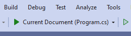
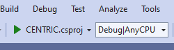

# NET Centric Programming

NET Centric daily assignments and practices

> **IMPORTANT** \
> Please be aware that the README files and some comments in the code files have been autogenerated.

## Table of Contents

- [Directories](#directories)
- [How to Run the Code](#how-to-run-the-code)

## Directories

1. [Assignments](./assignments/) - Each day topics and such
2. [Codes](./codes/) - Codes upto day 08
3. [Applications](./applications/) - Applications code files from day 09

## How to Run the Code

1. Clone the Repository:

```bash
git clone https://github.com/asminbhattarai/bmc-csit-2078.git
cd daily-updated-code
```

2. Open the Project:

    - Open the [Program.cs](./daily-updated-code/Program.cs) file and any other day-specific .cs files in Visual Studio.

    - You can also use the [CENTRIC.csproj](./daily-updated-code/CENTRIC.csproj) file to open the whole project.

    - Easiest: Right click [daily-updated-code](./daily-updated-code), (click show more options,) and open with visual studio. Then, simply run Program.cs or CENTRIC.csproj.
    
        > 
        > . 

3. Build and Run:

    - Build and run the project by selecting the appropriate Day from the options provided in Program.cs.

4. Select a Day: When you run the program, it will prompt you to select a day (from 1 to `day-last`). Choose the day you'd like to run by typing the number and pressing Enter.